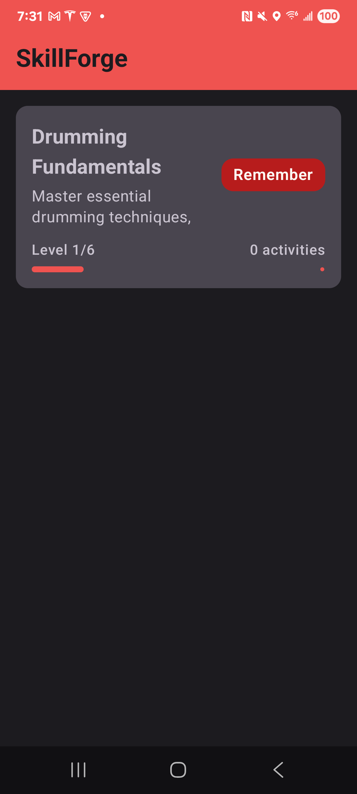
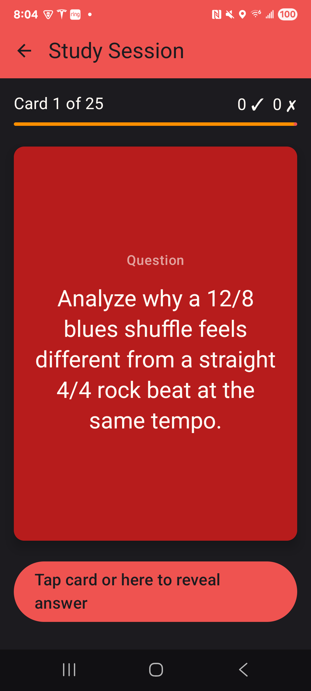
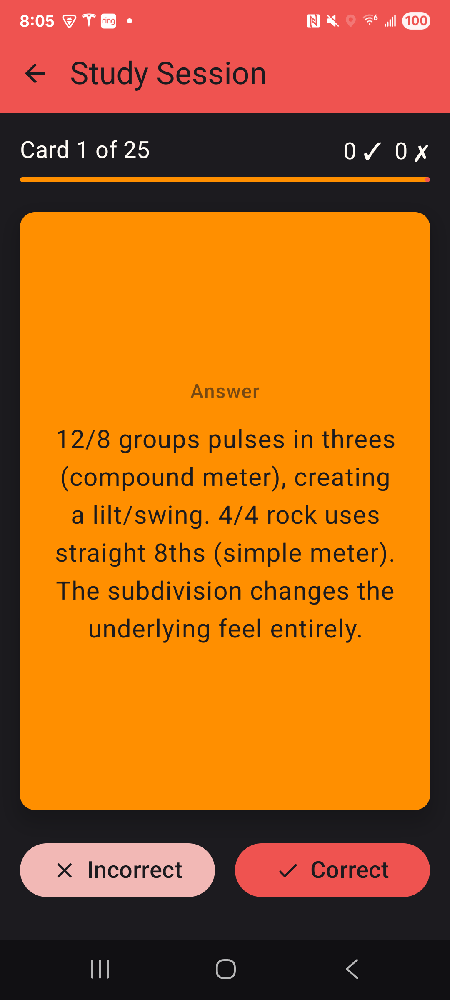

# 🥁 SkillForge

**Master any skill, one level at a time.**

SkillForge is an on-device ML-powered learning progression app built with Kotlin and Jetpack
Compose. Users create skills, study flashcards, and progress through Bloom's Taxonomy levels based
on AI-driven recommendations.

[](https://developer.android.com)
[](https://kotlinlang.org)
[](https://developer.android.com/jetpack/compose)
[](LICENSE)

---

## 📖 Overview

SkillForge helps learners progress through **Bloom's Taxonomy** - a proven educational framework
that structures learning from basic recall to creative mastery:

| Level             | Description                            | Example (Drumming)                         |
|-------------------|----------------------------------------|--------------------------------------------|
| 🟣 **Remember**   | Recall facts and basic concepts        | "What is a paradiddle?"                    |
| 🔵 **Understand** | Explain ideas and concepts             | "Why start rudiments at 60 BPM?"           |
| 🟢 **Apply**      | Use information in new situations      | "Play a paradiddle for 2 minutes"          |
| 🟡 **Analyze**    | Draw connections among ideas           | "Compare flam vs drag technique"           |
| 🟠 **Evaluate**   | Justify a decision or course of action | "When to use matched vs traditional grip?" |
| 🔴 **Create**     | Produce new or original work           | "Compose an 8-bar fill using 3 rudiments"  |

The app uses **on-device machine learning** to analyze your practice patterns and recommend
personalized next steps—all without sending your data to the cloud.

---

## ✨ Features

- **📚 Flashcard System** - Create and study cards with text, images, and audio
- **📊 Progress Tracking** - Automatic activity logging and streak tracking
- **🧠 ML-Powered Recommendations** - On-device TensorFlow Lite inference
- **🎯 Bloom's Taxonomy Progression** - Structured advancement through 6 levels
- **🥁 Starter Content** - Ships with "Drumming Fundamentals" skill pack
- **🌙 Dark Mode** - Full light/dark theme support

---

## 🛠 Tech Stack

| Category                 | Technology                   |
|--------------------------|------------------------------|
| **Language**             | Kotlin                       |
| **UI Framework**         | Jetpack Compose + Material 3 |
| **Architecture**         | MVVM + Clean Architecture    |
| **Dependency Injection** | Hilt                         |
| **Database**             | Room                         |
| **ML Runtime**           | TensorFlow Lite              |
| **Async**                | Kotlin Coroutines + Flow     |
| **Min SDK**              | 26 (Android 8.0)             |
| **Target SDK**           | 36                           |

---

## 🏗 Architecture

```
com.example.skillforge/
├── data/
│   ├── model/           # Entity classes
│   ├── repository/      # Repository implementations
│   ├── local/           # Room database, DAOs, converters
│   └── starter/         # Pre-loaded content
├── ml/
│   ├── model/           # TFLite model wrappers
│   ├── feature/         # Feature extraction
│   ├── inference/       # Interpreter management
│   └── scheduling/      # Inference caching & scheduling
├── domain/
│   ├── usecase/         # Business logic
│   └── engine/          # Progression engine
├── ui/
│   ├── screens/         # Compose screens
│   ├── components/      # Reusable UI components
│   ├── viewmodel/       # ViewModels
│   └── theme/           # Material 3 theming
└── di/                  # Hilt modules
```

---

## 🚀 Getting Started

### Prerequisites

- Android Studio Hedgehog (2023.1.1) or newer
- JDK 17+
- Android device or emulator (API 26+)

### Build & Run

```bash
# Clone the repository
git clone https://github.com/jdavault/SkillForge.git
cd SkillForge

# Build the project
./gradlew build

# Install on connected device
./gradlew installDebug
```

---

## 🎨 Theme

SkillForge features a **drumming-inspired color palette**:

| Color        | Light Mode | Dark Mode | Usage              |
|--------------|------------|-----------|--------------------|
| **Crimson**  | `#B71C1C`  | `#EF5350` | Primary actions    |
| **Amber**    | `#FF8F00`  | `#FFCA28` | Secondary elements |
| **Charcoal** | `#37474F`  | `#90A4AE` | Tertiary accents   |

---

## 📱 Screenshots

  <table>
    <tr>
      <td></td>
      <td></td>
      <td></td>
    </tr>
  </table>

---

## 🗺 Roadmap

- [x] **Session 1**: Project setup, Hilt DI, theming
- [x] **Session 2**: Data models & Room database
- [x] **Session 3**: Repository layer & DI modules
- [x] **Session 4**: Drummer starter pack content
- [x] **Session 5**: Home & Dashboard UI
- [x] **Session 6**: Flashcard system
- [ ] **Session 7**: Activity tracking
- [ ] **Session 8**: Progression engine (rules-based)
- [ ] **Session 9**: ML infrastructure
- [ ] **Session 10**: Feature engineering
- [ ] **Session 11**: Train & export TFLite model
- [ ] **Session 12**: ML integration & hybrid engine
- [ ] **Session 13**: Recommendations UI
- [ ] **Session 14**: Polish & UX
- [ ] **Session 15**: Testing & wrap-up

---

## 📄 License

This project is licensed under the MIT License - see the [LICENSE](LICENSE) file for details.

---

## 🙏 Acknowledgments

- Built as a learning project with guidance from Claude Code
- Inspired by Bloom's Taxonomy educational framework
- Drumming content inspired by classic rudiment studies

---

<p align="center">
  <b>Built with ❤️ and 🥁</b>
</p>
